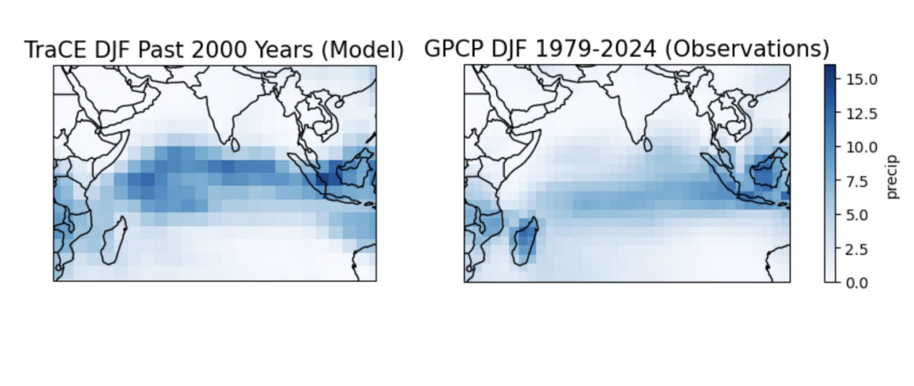
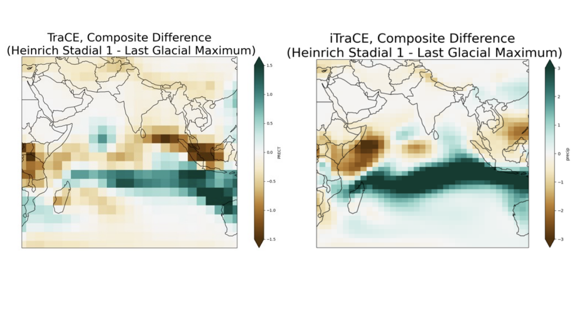
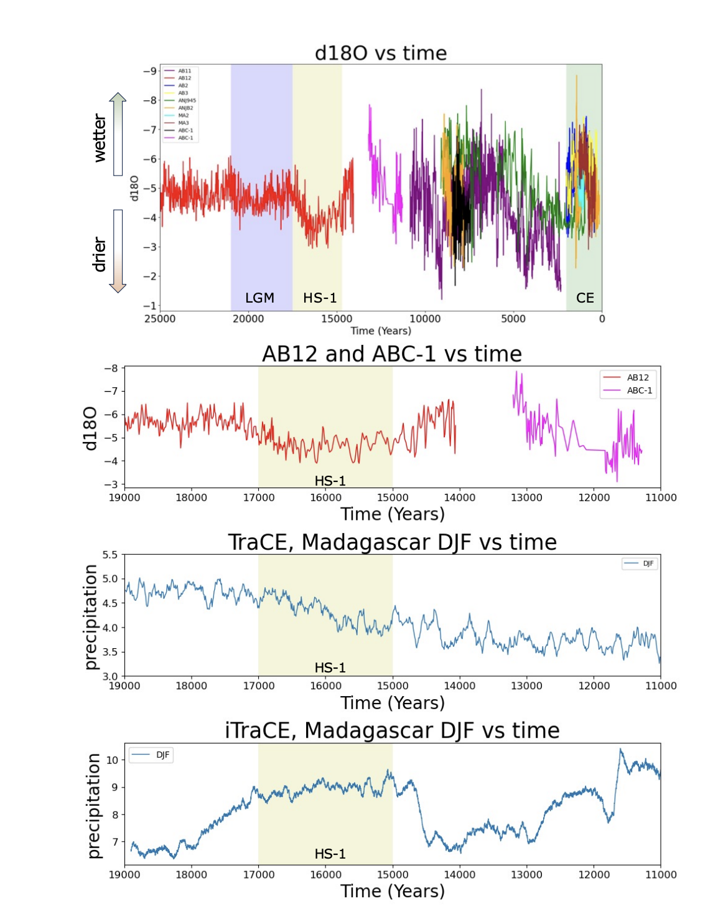

# Understanding Monsoon Dynamics in East Africa (Madagascar) and the Southern Indian Ocean (MIT MSRP 2024)

This repository contains the full analysis pipeline developed during the MIT Summer Research Program (MSRP 2024) in the McGee Laboratory (MIT EAPS). The goal of this project is to compare paleoclimate proxy records from Madagascar with TraCE-21ka and iTraCE-21ka climate model simulations to better understand long-term monsoon variability in the Southern Indian Ocean.

All work is implemented in Python using Jupyter Notebooks:

- `TraCE_vs_Observations.ipynb`

- `Comp_Diff_TraCE.ipynb`

- `Comp_Diff_iTraCE.ipynb`

- `LGM_TimeSeries_vs_TraCE.ipynb`

- `iTrace_vs_AB-12.ipynb`

---

## 1. Abstract

Current climate data represents only a small fraction of Earth’s climate history, and observational records of long-term monsoon behavior in the Southern Indian Ocean are extremely limited. Paleoclimate proxies, such as speleothems, allow scientists to infer past climate variability, particularly precipitation, temperature, and large-scale circulation changes, far beyond the instrumental era.

This project analyzes spatial climate data using Python and compares paleoclimate records to climate model simulations to better constrain monsoon dynamics during past climate states. Three comparative analyses form the core of this study: 

### 1. TraCE-21ka vs. GPCP observational precipitation
### 2. TraCE-21ka vs. iTraCE-21ka simulations
### 3. Both model simulations vs. speleothem δ¹⁸O records from Madagascar (AB-12, ABC-1)

Spatial visualization of precipitation fields reveals significant inconsistencies in seasonal rainfall over the Southern Indian Ocean during both the Last Glacial Maximum (LGM) and Heinrich Stadial 1 (HS1). While TraCE simulations reasonably reproduce proxy signals during HS1, iTraCE simulations show mismatches with both AB-12 and ABC-1 records.

Future work should isolate single-forcing iTraCE CCSM3 experiments and compare them directly with TraCE CCSM3 single-forcing simulations and speleothem archives. Expanding paleoclimate datasets from the region will further improve model validation and accuracy.

---

## 2. Scientific Motivation

Monsoon systems in the Southern Indian Ocean remain understudied compared to the Asian and African monsoons. Yet, they strongly influence precipitation patterns across Madagascar, the Mascarene Islands, and parts of coastal East Africa.

Understanding past monsoon dynamics is essential for:

- Constraining precipitation biases in global climate models

- Improving predictions of future hydroclimate extremes

- Linking ocean–atmosphere feedbacks to regional rainfall variability

### Why Speleothems?

Stalagmites provide continuous, high-resolution δ¹⁸O records that are sensitive to changes in:

- Precipitation amount

- Sea-surface temperature

- Large-scale monsoon circulation

### Why TraCE and iTraCE models?

TraCE-21ka and iTraCE-21ka simulate deglacial climate evolution but differ in:

- Forcing schemes

- Representation of ocean/atmosphere coupling

- Resolution of monsoon systems

Evaluating them against real proxy archives is crucial for improving future climate projections.

---

## 3. Methodology

### Climate Model Preprocessing

- Loaded TraCE and iTraCE NetCDF files with xarray

- Computed seasonal and annual climatologies

- Extracted Last Glacial Maximum (19–23 ka) and Heinrich Stadial 1 windows

- Created difference maps and anomaly fields

### Proxy Record Comparison

- Processed AB-12 and ABC-1 δ¹⁸O speleothem data

- Aligned proxy ages with model years using age-depth models

### Visualization Tools

- matplotlib + cartopy for spatial maps

- Line plots for time series comparisons

- Difference maps for highlighting model biases

---

## 4. Key Results

### 1. TraCE-21ka vs. GPCP

- TraCE captures large-scale rainfall patterns but underestimates precipitation over the southwest Indian Ocean.

### 2. TraCE vs. iTraCE

- iTraCE produces weaker Southern Indian Ocean monsoon circulation.

- Seasonal precipitation discrepancies are largest during austral summer (DJF).

### 3. TraCE/iTraCE vs. Speleothems

- TraCE aligns reasonably well with δ¹⁸O shifts during Heinrich Stadial 1.

- iTraCE fails to capture proxy-observed rainfall patterns near Madagascar.

- Proxy signals suggest stronger monsoon intensification than iTraCE simulates.

---

## 5. Figures

TraCE vs. GPCP Seasonal Precipitation

TraCE vs. iTraCE Difference Map (DJF)

δ¹⁸O Speleothem Comparison: AB-12 vs. iTraCE vs. TraCE

---

## 6. Future Work

- Isolate iTraCE CCSM3 single-forcing simulations (ice sheets, GHGs, meltwater, orbital forcing)

- Directly compare TraCE and iTraCE single-forcing outputs to assess which forcing drives the discrepancies

- Expand proxy network beyond Madagascar

- Evaluate moisture transport pathways using water-isotope-enabled models (e.g., IsoGSM, iCESM)

---

## 7. Acknowledgements

This research was conducted as part of the MIT Summer Research Program (MSRP 2024) in the McGee Laboratory, MIT Department of Earth, Atmospheric, and Planetary Sciences. I would like to thank my mentors, Dr. David McGee and Benjamin Tiger, for their guidance and support throughout this project. I would also like to thank the MIT Summer Research Program and the MIT Office of Graduate Education for the opportunity to participate in this research project and for supporting my growth as a researcher.
